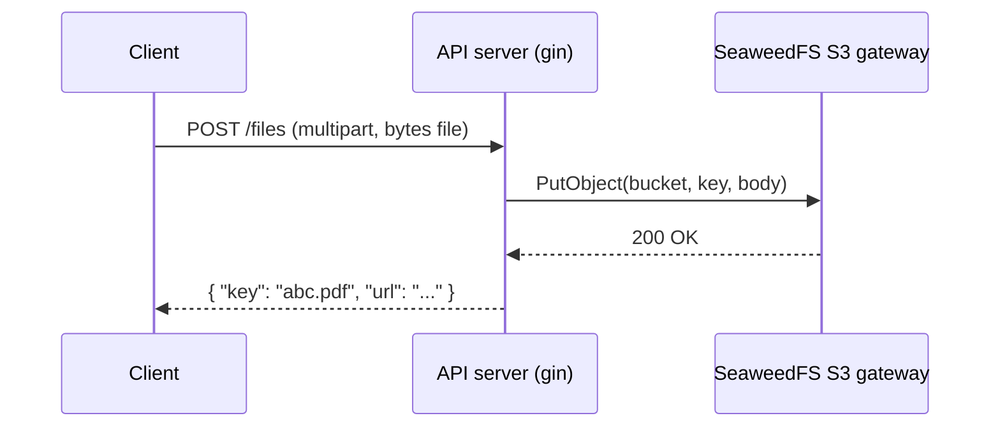
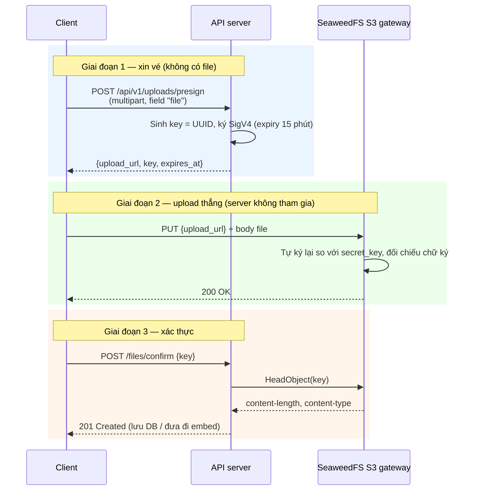

# Luồng upload file (SeaweedFS S3)

Tài liệu này mô tả 2 cách đẩy file lên SeaweedFS: **luồng hiện tại (server tự lưu)** và **luồng presigned URL (client tự upload)**, kèm chi tiết cách chữ ký hoạt động và các bẫy cần tránh khi triển khai.

## Tổng quan

| | Lưu qua server (hiện tại) | Presigned URL (đề xuất) |
|---|---|---|
| Đường đi của file | Client → API server → SeaweedFS | Client → SeaweedFS (thẳng) |
| Server có chạm bytes file? | Có | Không |
| RAM/băng thông server | Tốn | Gần như bằng 0 |
| File lớn (video, zip) | Dễ timeout / OOM | Không vấn đề |
| Server kiểm tra nội dung được? | Được (đọc stream) | Không — chỉ kiểm tra metadata |
| Độ phức tạp | Đơn giản | Ký SigV4 + verify sau upload |

---

## Interface `IStorage` — 4 method

Định nghĩa tại `../src/common/storage/storage.go`. Đây là **hợp đồng với kho file blob** — `key` trong cả 4 method là tên file trong bucket (vd `uploads/2026/abc.pdf`), không phải URL. Nhờ gom vào interface, sau này đổi SeaweedFS → S3/MinIO/local chỉ cần viết adapter mới, code nghiệp vụ không đổi.

```go
Upload(ctx context.Context, key string, r io.Reader, size int64, contentType string) error
Download(ctx context.Context, key string) (io.ReadCloser, error)
Delete(ctx context.Context, key string) error
PresignedURL(ctx context.Context, key string, expiry time.Duration) (string, error)
```

| Method | Việc làm | Analog | Trả về |
|---|---|---|---|
| `Upload` | Server tự ghi file vào kho | tự mang hàng vào kho | `error` |
| `Download` | Đọc file ra từ kho | lấy hàng từ kho | stream `io.ReadCloser` |
| `Delete` | Xóa vĩnh viễn file | hủy hàng | `error` |
| `PresignedURL` | Ký URL tạm cho client tự upload | phát phiếu ra cửa | `string` (URL) |

### 1. `Upload(ctx, key, reader, size, contentType)`

```go
storage.Upload(ctx, "uploads/abc.pdf", fileStream, 524288, "application/pdf")
```

- `reader` — luồng bytes, đọc dần, không load cả file vào RAM
- `size` — S3 bắt buộc biết `Content-Length` trước khi ghi
- `contentType` — để khi tải về trình duyệt mở đúng loại
- Chỉ trả `error`: thành công nghĩa là file đã nằm trong kho

**Dùng khi:** client gửi multipart qua API (luồng 1), hoặc worker tạo file kết quả.

### 2. `Download(ctx, key)`

```go
rc, err := storage.Download(ctx, "uploads/abc.pdf")
defer rc.Close()            // bắt buộc — trả kết nối về pool
body, _ := io.ReadAll(rc)   // hoặc stream tiếp
```

Trả **stream** chứ không phải `[]byte` — file 2GB không đè sập RAM.

**Dùng khi:** API cho tải file, hoặc worker đọc nội dung để đưa đi embed.

### 3. `Delete(ctx, key)`

**Dùng khi:** user xóa tài liệu, dọn file upload lỗi, retry ghi đè sạch file cũ.

### 4. `PresignedURL(ctx, key, expiry)`

```go
url, _ := storage.PresignedURL(ctx, "uploads/abc.pdf", 15*time.Minute)
// URL có chữ ký SigV4 + X-Amz-Expires=900 — 15 phút sau tự vô hiệu
// file CHƯA tồn tại — client PUT vào mới có
```

**Không đụng tới file**, chỉ tính HMAC tạo URL có hạn. Trả `string` — chính là thứ đưa về client để nó tự upload (mục ② luồng 2).

**Dùng khi:** luồng 2 — client tự đẩy file thẳng vào kho.

### `Upload` vs `PresignedURL` — 2 cách đưa file vào, thay thế nhau

```
Upload (luồng 1)                          PresignedURL (luồng 2)
────────────────                          ──────────────────────
client ──file──▶ server ──ghi──▶ kho      client ──xin vé──▶ server
server thấy từng byte                     server ──URL──▶ client
tốn RAM/băng thông                        client ──file──▶ kho (thẳng)
                                          server CHỈ thấy tên file, tốn ~0
```

Không dùng cả hai cho cùng 1 file.

---

## Luồng 1 — Server tự lưu (đang chạy)

```
Client ──① multipart/form-data──▶ API server ──② PutObject──▶ SeaweedFS
Client ◀──③ { key, url } ────── API server
```



### Các bước

1. **Client** gửi file dạng `multipart/form-data` tới API server.
2. **API server** đọc stream từ request, gọi `Storage.Upload(ctx, key, reader, size, contentType)`.
3. `Upload` (`src/infrastructure/seaweedfs/storage.go:51`) dùng aws-sdk-go-v2 gọi `PutObject` tới SeaweedFS (path-style, static creds, region `us-east-1`).
4. SeaweedFS ghi file vào volume, trả `200`.
5. API server trả `key`/URL về cho client.

### Ưu điểm

- Đơn giản, kiểm soát hoàn toàn: validate content-type, size, scan virus, ghi DB metadata ngay tại chỗ.
- Không cần lo host của SeaweedFS có truy cập được từ trình duyệt hay không.

### Nhược điểm

- **Bytes đi qua server**: file 500MB = 500MB RAM/băng thông tiêu tốn ở server, server là bottleneck.
- Giữ kết nối mở trong suốt thời gian upload → dễ timeout với mạng chậm.
- Không tái sử dụng được cho client trực tiếp (mobile/SPA không muốn gửi file 2 lần).

---

## Luồng 2 — Presigned URL (client tự upload)

Ýtưởng: **server không nhận file, server chỉ cấp "vé tạm"**. Client cầm vé đó ghi thẳng vào SeaweedFS.

```
① Client ── POST /uploads/presign (multipart/form-data, field "file") ──▶ API server
② API server ── ký URL bằng secret_key ──▶ trả {upload_url, key, expires_at}
③ Client ── PUT file (vé nằm trong URL) ──▶ SeaweedFS
④ SeaweedFS tự ký lại, khớp ──▶ ghi file
⑤ Client ── "upload xong" ──▶ API server
⑥ API server ── HeadObject(key) xác thực ──▶ lưu DB / đưa đi embed
```



### Bước chi tiết

**① Client xin vé** — request là `multipart/form-data` với 1 file part tên `file`. Server **chỉ đọc tên file** (`c.FormFile("file")` → `file.Filename`), không lưu bytes:

```http
POST /api/v1/uploads/presign
Content-Type: multipart/form-data; boundary=...

--...
Content-Disposition: form-data; name="file"; filename="bao-cao.pdf"
Content-Type: application/pdf

...bytes file...
--...--
```

Loại file do BE chốt 2 lớp: whitelist đuôi file (`allowedExts`) + sniff magic
bytes 512 đầu (`http.DetectContentType` đối chiếu allow-map) — `.exe` đổi tên
`.pdf` bị chặn 400 vì sniff ra `application/octet-stream`. Header `Content-Type`
của part do client khai nên BE lờ hoàn toàn. Handler đọc multipart theo kiểu
streaming (`MultipartReader`): chỉ giữ tên file + 512B đầu mỗi part, phần còn
lại không buffer vào RAM hay đĩa. MIME đã verify được nhét vào chữ ký
presigned URL và trả về trong `content_type` — client PUT phải gửi đúng.

**② Server ký URL** — toàn bộ "bí thuật" nằm ở đây, chỉ 3 dòng:

```go
presignClient := s3.NewPresignClient(s.client)
res, err := presignClient.PresignPutObject(ctx, &s3.PutObjectInput{
    Bucket: aws.String(s.bucket),
    Key:    aws.String(key), // key do server sinh, KHÔNG nhận từ client
}, func(o *s3.PresignOptions) {
    o.Expires = 15 * time.Minute
})
// res.URL chính là chuỗi trả về cho client
```

Kết quả là URL trông như sau:

```
http://seaweedfs-s3:8333/app-uploads/550e8400-e29b-41d4-a716-446655440000.pdf
  ?X-Amz-Algorithm=AWS4-HMAC-SHA256
  &X-Amz-Credential=theron_access_key%2F20261005%2Fus-east-1%2Fs3%2Faws4_request
  &X-Amz-Date=20261005T120000Z
  &X-Amz-Expires=900
  &X-Amz-SignedHeaders=host
  &X-Amz-Signature=8f3a9c...
```

| Tham số | Ý nghĩa |
|---|---|
| `X-Amz-Algorithm` | Thuật toán ký — `AWS4-HMAC-SHA256` (SigV4) |
| `X-Amz-Credential` | Access key + ngày + region + service — cho biết **ai** ký |
| `X-Amz-Date` | Thời điểm ký — chữ ký chỉ có hiệu lực quanh mốc này |
| `X-Amz-Expires` | Số giây hiệu lực (900 = 15 phút) |
| `X-Amz-SignedHeaders` | Các header bị đưa vào chữ ký (ở đây là `host`) |
| `X-Amz-Signature` | Chuỗi HMAC — phần server sẽ kiểm tra |

**③ Client PUT file** — đưa nguyên URL đó vào `fetch`/`axios`, method phải là `PUT`, header `Content-Type` phải khớp những gì đã ký.

**④ SeaweedFS xác minh** — gateway tự tính lại chữ ký từ `secret_key` + nội dung request, khớp thì ghi file, sai thì `403 SignatureDoesNotMatch`.

**⑤⑥ Xác thực sau upload** — SeaweedFS **không có callback** về cho server trong thiết lập này, nên không được tin lời client. Server phải tự `HeadObject(key)` để xác nhận file thật sự tồn tại, kiểm tra `Content-Length` (đã đủ bytes chưa) rồi mới lưu DB hoặc đưa đi embedding.

### Vì sao an toàn

- **`secret_key` không bao giờ rời khỏi server** — client chỉ nhận URL đã ký.
- **Có hạn** — hết `X-Amz-Expires` thì URL thành rác, không dùng lại được.
- **Binds method + key + host** — chữ ký được tính trên `PUT /app-uploads/xxx.pdf`, đổi sang `GET` hoặc key khác là hỏng ngay.
- **Không lộ nội dung** — server chưa bao giờ thấy file.

---

## Bẫy khi triển khai

1. **Host trong URL không truy cập được**
   `configs/config.json:17` đang là `http://seaweedfs-s3:8333` — host Docker network, trình duyệt ngoài không resolve được. URL presign được ký **theo đúng host này**, nên đổi host sau khi ký là chữ ký hỏng. Cần thêm config riêng, ví dụ:

   ```json
   "storage": {
     "s3_endpoint": "http://seaweedfs-s3:8333",
     "public_endpoint": "http://localhost:8333"
   }
   ```

   Lúc presign, dùng `public_endpoint` làm `BaseEndpoint` của client ký.

2. **Không nhận `key` từ client**
   Để client tự đặt tên file = ghi đè file người khác / ghi path tùy ý. Server phải sinh key (UUID) + sanitize tên gốc, rồi mới ký.

3. **Không có event notification**
   SeaweedFS trong thiết lập này không bắn sự kiện khi file được ghi. Luồng bắt buộc phải có bước `HeadObject` xác thực (mục ⑥ ở trên) — cũng là chỗ tự nhiên để kiểm tra size, content-type.

4. **`Content-Type` phải khớp chữ ký**
   Nếu ký kèm `content-type` trong `SignedHeaders` mà client gửi sai thì `403`. Ký chỉ `host` thì đơn giản hơn nhưng mất quyền kiểm soát loại file.

5. **Không có permission check theo từng người**
   Ai xin được URL thì ghi được vào key đó. Kiểm tra quyền (đăng nhập, quota, loại file cho phép) phải làm ở **bước ①** trước khi ký.

---

## Trạng thái hiện tại trong repo

`IStorage` (`../src/common/storage/storage.go`) đã có đủ 4 method:

```go
Upload(ctx context.Context, key string, r io.Reader, size int64, contentType string) error
Download(ctx context.Context, key string) (io.ReadCloser, error)
Delete(ctx context.Context, key string) error
PresignedURL(ctx context.Context, key string, expiry time.Duration) (string, error)
```

- `Upload` / `Download` / `Delete` — đã cài trong `../src/infrastructure/seaweedfs/storage.go` (luồng 1)
- `PresignedURL` — đã cài bằng `s3.NewPresignClient(...).PresignPutObject`, **trả về URL PUT** (dùng cho upload, đúng luồng 2). Cần URL GET để tải file thì đổi `PresignPutObject` → `PresignGetObject`.
- `src/controller/routers/router.go:28-31` — chỉ có `/ping`, `/pong`, `/users`, **chưa có `/uploads/presign`**

### Việc còn lại để có luồng 2

1. ~~`PresignedURL` trong `IStorage`~~ — ✅ xong
2. ~~Cài `PresignPutObject` trong seaweedfs~~ — ✅ xong
3. `../configs/config.json` + `src/config/config.go` — thêm `public_endpoint` (hiện URL sẽ mang host `seaweedfs-s3:8333` của Docker network, client ngoài không mở được)
4. `../src/controller/dtos` — `PresignUploadRequest` / `PresignUploadResponse` (snake_case, không hậu tố `Dto`)
5. `../src/controller/services` + `src/controller/apis/` — handler `POST /uploads/presign`: sinh key (UUID), kiểm quyền, gọi `PresignedURL`, `Render`
6. `../src/controller/routers/router.go` — đăng ký route
7. Xác thực sau upload: `HeadObject` trước khi lưu DB / đẩy đi embed
8. Swagger annotation + `swag init -g cmd/main.go`
